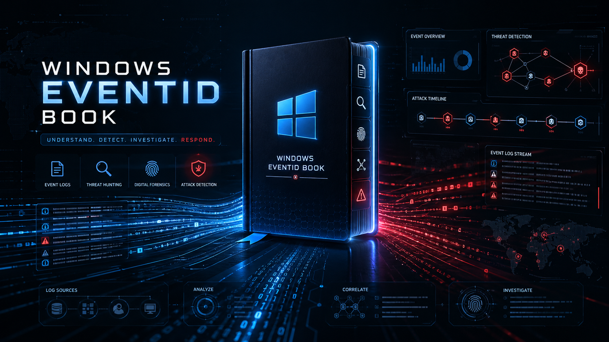

# 📘 Windows EventID Book

  

---

## Overview

**Windows EventID Book** is a curated and structured reference of Windows Event IDs, designed to support:

- 🛡️ Threat Hunting  
- 🔎 DFIR (Digital Forensics & Incident Response)  
- 📡 SOC Analysis & Monitoring  

This project helps security professionals quickly identify, understand, and investigate critical Windows events during real-world scenarios.

---

## Event Log Categories

1. [SECURITY (Security.evtx)](#1-security-securityevtx)
2. [SYSMON (Sysmon Operational Log)](#2-sysmon-sysmon-operational-log)
3. [SYSTEM (System.evtx)](#3-system-systemevtx)
4. [APPLICATION (Application.evtx)](#4-application-applicationevtx)
5. [FIREWALL (Windows Defender Firewall Logs)](#5-firewall-windows-defender-firewall-logs)
6. [POWERSHELL](#6-powershell)
7. [KERBEROS / AUTHENTICATION (AD DS Logs)](#7-kerberos--authentication-ad-ds-logs)
8. [FILE SHARE / SMB ACTIVITY](#9-file-share--smb-activity)
9. [TASK SCHEDULER](#10-task-scheduler)
10. [WINDOWS DEFENDER / ANTIVIRUS](#11-windows-defender--antivirus)

---

## 1. SECURITY (Security.evtx)

| Event ID | Name                              | Description                                    | Threat Hunting Value                                         |
| -------- | --------------------------------- | ---------------------------------------------- | ------------------------------------------------------------ |
| 4624     | Successful Logon                  | A user successfully logged into the system     | Detect lateral movement, unusual logins, brute-force success |
| 4625     | Failed Logon                      | A logon attempt failed                         | Brute force, password spraying, credential stuffing          |
| 4634     | Logoff                            | User session ended                             | Session tracking, unusual session duration                   |
| 4648     | Logon with Explicit Credentials   | A process used different credentials to log in | Pass-the-hash, lateral movement detection                    |
| 4672     | Special Privileges Assigned       | Admin-level privileges granted at logon        | Privilege escalation detection                               |
| 4688     | Process Creation                  | A new process was created                      | Malware execution, LOLBins detection                         |
| 4689     | Process Exit                      | A process terminated                           | Execution flow tracking                                      |
| 4697     | Service Installed                 | A new service was installed                    | Persistence via services                                     |
| 4719     | Audit Policy Changed              | Audit policy was modified                      | Defense evasion (log disabling)                              |
| 4720     | User Account Created              | A new user account was created                 | Unauthorized account creation                                |
| 4722     | User Account Enabled              | Disabled account was enabled                   | Account takeover, insider threat                             |
| 4723     | Password Change Attempt           | User attempted password change                 | Credential abuse detection                                   |
| 4724     | Password Reset Attempt            | Password reset performed                       | Privilege abuse or account takeover                          |
| 4725     | User Account Disabled             | Account was disabled                           | Attack cleanup or insider activity                           |
| 4726     | User Account Deleted              | Account removed from system                    | Persistence removal or sabotage                              |
| 4732     | Added to Local Group              | User added to privileged group                 | Privilege escalation                                         |
| 4738     | User Account Modified             | Account properties changed                     | Persistence or privilege manipulation                        |
| 4740     | Account Locked Out                | Account locked due to failed attempts          | Brute-force detection                                        |
| 4768     | Kerberos TGT Requested            | Ticket Granting Ticket requested               | Authentication analysis, lateral movement                    |
| 4769     | Kerberos Service Ticket Requested | Service ticket requested                       | Lateral movement, access tracking                            |
| 4776     | NTLM Authentication               | NTLM authentication attempt                    | Legacy auth abuse, pass-the-hash                             |
| 1102     | Audit Log Cleared                 | Security logs were cleared                     | Log tampering / defense evasion                              |

---

## 2. SYSMON (Sysmon Operational Log)

| Event ID | Name                         | Description                          | Threat Hunting Value                                    |
| -------- | ---------------------------- | ------------------------------------ | ------------------------------------------------------- |
| 1        | Process Creation             | A new process was created            | Detect malware execution, LOLBins, command-line attacks |
| 2        | File Creation Time Changed   | File timestamp modified              | Timestomping (evasion technique)                        |
| 3        | Network Connection           | Process initiated network connection | C2 traffic, data exfiltration, suspicious IPs           |
| 4        | Sysmon Service State Change  | Sysmon service started/stopped       | Detection evasion (sensor disable attempts)             |
| 5        | Process Terminated           | A process ended                      | Track execution lifecycle                               |
| 6        | Driver Loaded                | Kernel driver loaded                 | Rootkits, malicious drivers                             |
| 7        | Image Loaded (DLL)           | DLL loaded into process              | DLL injection, sideloading attacks                      |
| 8        | CreateRemoteThread           | Thread created in another process    | Process injection (classic malware behavior)            |
| 9        | Raw Access Read              | Direct disk read access              | Credential dumping, LSASS access                        |
| 10       | Process Access               | One process accessed another         | Credential theft, LSASS injection                       |
| 11       | File Created                 | File created on system               | Malware dropper activity                                |
| 12       | Registry Key Created/Deleted | Registry structure modified          | Persistence mechanisms                                  |
| 13       | Registry Value Set           | Registry value modified              | Startup persistence, malware config                     |
| 14       | Registry Key/Value Renamed   | Registry object renamed              | Evasion and persistence hiding                          |
| 15       | File Stream Created          | Alternate Data Stream (ADS) created  | Hidden payloads in NTFS ADS                             |
| 17       | Pipe Created                 | Named pipe created                   | C2 communication, lateral movement                      |
| 18       | Pipe Connected               | Named pipe accessed                  | Inter-process or lateral communication                  |
| 19       | WMI Event Filter             | WMI persistence created              | Advanced persistence technique                          |
| 20       | WMI Consumer                 | WMI event consumer created           | Execution persistence via WMI                           |
| 21       | WMI Binding                  | WMI filter-consumer binding          | Full WMI persistence chain                              |
| 22       | DNS Query                    | DNS request made by process          | Domain-based C2 detection, DGA malware                  |

---

## 3. SYSTEM (System.evtx)

| Event ID | Name                       | Description                                | Threat Hunting Value                                       |
| -------- | -------------------------- | ------------------------------------------ | ---------------------------------------------------------- |
| 7045     | Service Installed          | A new service was installed                | Strong persistence indicator (malware/services)            |
| 7040     | Service Start Type Changed | Service startup type modified              | Persistence (auto-start services)                          |
| 7036     | Service State Changed      | Service started or stopped                 | Track suspicious service execution                         |
| 7034     | Service Crashed            | Service terminated unexpectedly            | Crash from exploit or malicious interference               |
| 7022     | Service Failed to Start    | Service failed to start                    | Broken persistence or blocked malware                      |
| 7000     | Service Failed to Start    | Service could not start                    | Suspicious or misconfigured services                       |
| 6008     | Unexpected Shutdown        | System shut down unexpectedly              | Forced shutdown (possible attacker activity)               |
| 1074     | System Shutdown Initiated  | Shutdown/restart triggered by process/user | Identify who initiated shutdown (key in IR investigations) |
| 41       | Kernel Power Critical      | System rebooted without clean shutdown     | Crash, exploit, or forced reboot                           |
| 1102     | Audit Log Cleared (Mirror) | Security logs cleared (system reflection)  | Defense evasion / log tampering                            |

---

## 4. APPLICATION (Application.evtx)

| Event ID | Name                     | Description                        | Threat Hunting Value                                      |
| -------- | ------------------------ | ---------------------------------- | --------------------------------------------------------- |
| 1000     | Application Error        | An application crashed             | Crash of security tools, exploit attempts, malware issues |
| 1001     | Windows Error Reporting  | Crash report generated             | Correlate with suspicious crashes (e.g. LSASS, AV)        |
| 1026     | .NET Runtime Exception   | .NET application error             | Malicious .NET payloads, offensive tools                  |
| 11707    | Application Installed    | Application successfully installed | Unauthorized software installation                        |
| 11724    | Application Uninstalled  | Application removed                | Defense evasion (removing tools)                          |
| 1033     | MSI Installation Success | MSI package installed              | Software deployment tracking / persistence                |
| 1034     | MSI Installation Failed  | MSI installation failed            | Failed malicious installation attempts                    |
| 1002     | Application Hang         | Application stopped responding     | Exploit attempts / process instability                    |
| 1309     | ASP.NET Event            | Web application error              | Web exploitation attempts (on servers)                    |
| 18456    | SQL Server Login Failed  | Failed login to SQL Server         | Brute force / credential attacks on databases             |
| 33205    | SQL Server Audit Event   | SQL Server audit log               | Suspicious DB access / queries                            |

---

## 5. FIREWALL (Windows Defender Firewall Logs)

| Event ID | Name                            | Description                           | Threat Hunting Value                                      |
| -------- | ------------------------------- | ------------------------------------- | --------------------------------------------------------- |
| 2004     | Firewall Rule Added             | A new firewall rule was created       | Defense evasion / persistence (allow malicious traffic)   |
| 2005     | Firewall Rule Modified          | Existing firewall rule changed        | Rule tampering to bypass restrictions                     |
| 2006     | Firewall Rule Deleted           | Firewall rule removed                 | Defense evasion (removing protections)                    |
| 2033     | Firewall Rule Applied           | Firewall rule enforced                | Track suspicious or newly added rules                     |
| 5152     | Packet Blocked                  | Network packet blocked by firewall    | Detect scanning, brute force, malicious traffic           |
| 5154     | Firewall Allowed Listening Port | App opened a listening port           | Backdoors / unauthorized services                         |
| 5156     | Connection Allowed              | Connection permitted through firewall | C2 traffic, lateral movement                              |
| 5157     | Connection Blocked              | Connection blocked by firewall        | Suspicious outbound attempts                              |
| 5158     | Local Port Binding              | Process bound to a local port         | Service creation, reverse shells                          |

---

## 6. POWERSHELL

| Event ID | Name                 | Description                          | Threat Hunting Value                                   |
| -------- | -------------------- | ------------------------------------ | ------------------------------------------------------ |
| 400      | Engine Start         | PowerShell engine started            | Track PowerShell usage (who/when)                      |
| 403      | Engine Stop          | PowerShell engine stopped            | Session tracking                                       |
| 600      | Provider Lifecycle   | PowerShell provider started          | Context for execution                                  |
| 800      | Pipeline Execution   | PowerShell pipeline executed         | Command execution tracking                             |
| 4103     | Module Logging       | PowerShell module activity logged    | Track cmdlets used (Get-Process, Invoke-Command, etc.) |
| 4104     | Script Block Logging | PowerShell script content recorded   | Detect encoded/malicious scripts (VERY HIGH VALUE)     |
| 4105     | Script Started       | PowerShell script execution started  | Track script execution timeline                        |
| 4106     | Script Completed     | PowerShell script execution finished | Execution lifecycle                                    |

---

## 7. KERBEROS / AUTHENTICATION (AD DS Logs)

| Event ID | Name                               | Description                       | Threat Hunting Value                             |
| -------- | ---------------------------------- | --------------------------------- | ------------------------------------------------ |
| 4768     | Kerberos TGT Requested             | Ticket Granting Ticket requested  | Track initial authentication (who is logging in) |
| 4769     | Kerberos Service Ticket Requested  | Service ticket requested          | Lateral movement / service access tracking       |
| 4770     | Kerberos Ticket Renewed            | TGT renewed                       | Long-lived sessions / persistence                |
| 4771     | Kerberos Pre-Authentication Failed | Kerberos authentication failed    | Password spraying / brute-force detection        |
| 4776     | NTLM Authentication                | NTLM authentication attempt       | Legacy auth abuse / pass-the-hash                |
| 4624     | Successful Logon (Correlated)      | Successful authentication         | Validate login success after Kerberos activity   |
| 4625     | Failed Logon (Correlated)          | Failed authentication             | Confirm failed attempts                          |
| 4648     | Explicit Credentials Logon         | Logon using alternate credentials | Pass-the-hash / lateral movement                 |
| 4672     | Privileged Logon                   | Admin privileges assigned         | Privileged session tracking                      |

---

## 8. FILE SHARE / SMB ACTIVITY

---

## 9. TASK SCHEDULER

---

## 10. WINDOWS DEFENDER / ANTIVIRUS
